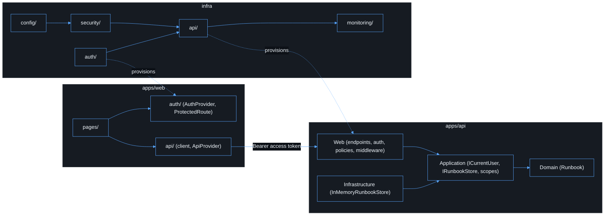
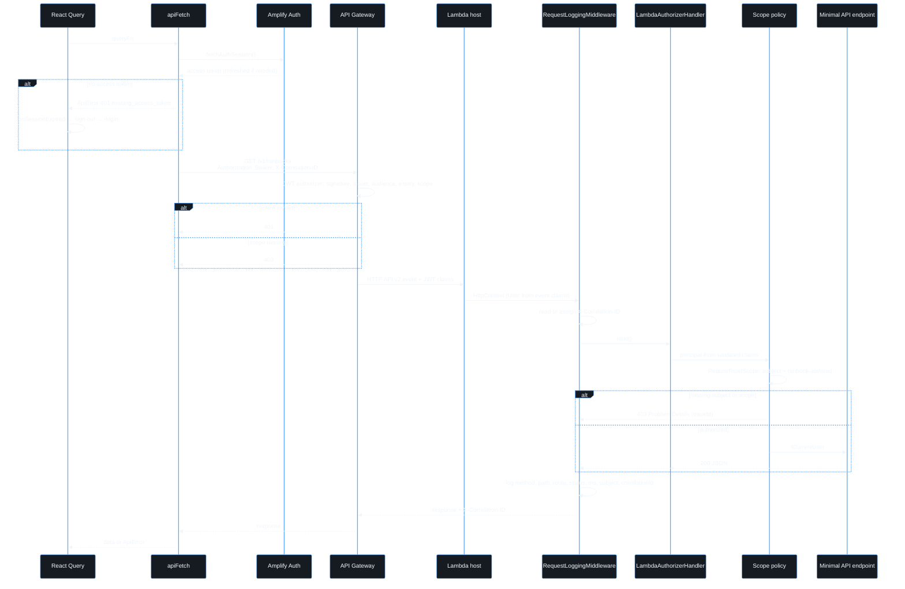
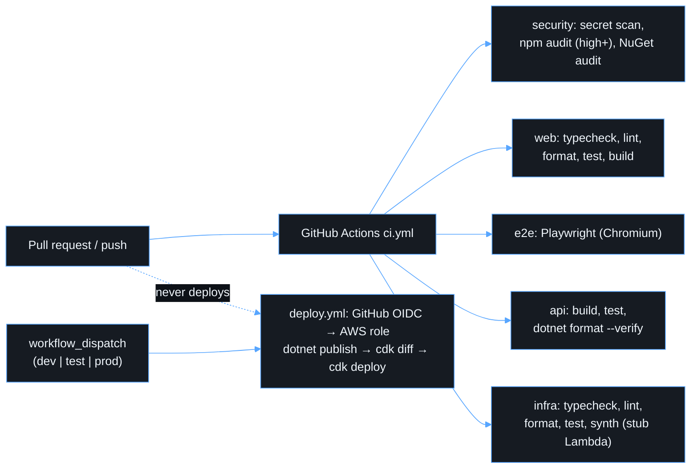

# Architecture

Cognito is the application identity boundary. Microsoft Entra authenticates users; Cognito issues the tokens the SPA and API consume.

## System architecture

```mermaid
%%{init: {
  "theme": "base",
  "securityLevel": "strict",
  "themeVariables": {
    "background": "#0d1117",
    "mainBkg": "#161b22",
    "secondBkg": "#1c2128",
    "primaryColor": "#161b22",
    "primaryTextColor": "#f0f6fc",
    "primaryBorderColor": "#58a6ff",
    "secondaryColor": "#21262d",
    "secondaryTextColor": "#f0f6fc",
    "secondaryBorderColor": "#3fb950",
    "tertiaryColor": "#21262d",
    "tertiaryTextColor": "#f0f6fc",
    "tertiaryBorderColor": "#d29922",
    "lineColor": "#58a6ff",
    "textColor": "#f0f6fc",
    "clusterBkg": "#161b22",
    "clusterBorder": "#30363d",
    "edgeLabelBackground": "#0d1117",
    "fontFamily": "Inter, Arial, Helvetica, sans-serif"
  }
}}%%
flowchart LR
    User["Enterprise User"]
    subgraph Browser["Browser"]
        React["React + TypeScript"]
        Amplify["AWS Amplify Auth"]
        ApiClient["Typed API Client"]
    end
    subgraph Identity["Identity"]
        Cognito["Amazon Cognito"]
        Entra["Microsoft Entra ID"]
    end
    subgraph AwsApi["AWS API Layer"]
        Gateway["API Gateway HTTP API"]
        Jwt["JWT Authorizer"]
        Lambda["AWS Lambda"]
        DotNet[".NET 10 API"]
    end
    User --> React
    React --> Amplify
    Amplify --> Cognito
    Cognito -->|"OIDC"| Entra
    Entra -->|"Authorization Code"| Cognito
    Cognito -->|"Cognito JWT"| Amplify
    Amplify --> ApiClient
    ApiClient -->|"Bearer Access Token"| Gateway
    Gateway --> Jwt
    Jwt -->|"Valid JWT + Scope"| Lambda
    Lambda --> DotNet
```

## Repository structure

- `apps/web` — React + Vite SPA (Amplify v6, PKCE)
- `apps/api` — .NET 10 Minimal APIs (Kestrel locally, Lambda `dotnet10` in AWS)
- `infra` — AWS CDK v2 (`auth/` Cognito, `api/` HTTP API + Lambda, `security/` synth-time guardrails, `monitoring/` alarms, `config/` typed environment)
- `docs` — operational documentation

## Request lifecycle

API Gateway validates Cognito access tokens and required OAuth scopes. Lambda receives an already-authenticated principal via `Amazon.Lambda.AspNetCoreServer`. The API still enforces scope policies, assigns a correlation ID, and logs one structured entry per request (method, path, route, status, duration, subject, correlation ID — never headers or tokens).

## CI/CD pipeline

CI (`.github/workflows/ci.yml`) typechecks, lints, format-checks, tests, audits dependencies, and synths. It does not deploy from pull requests. Deploy is `workflow_dispatch` with GitHub OIDC and a fixed choice of environment.

See [authentication.md](authentication.md), [deployment.md](deployment.md), and [security.md](security.md).
