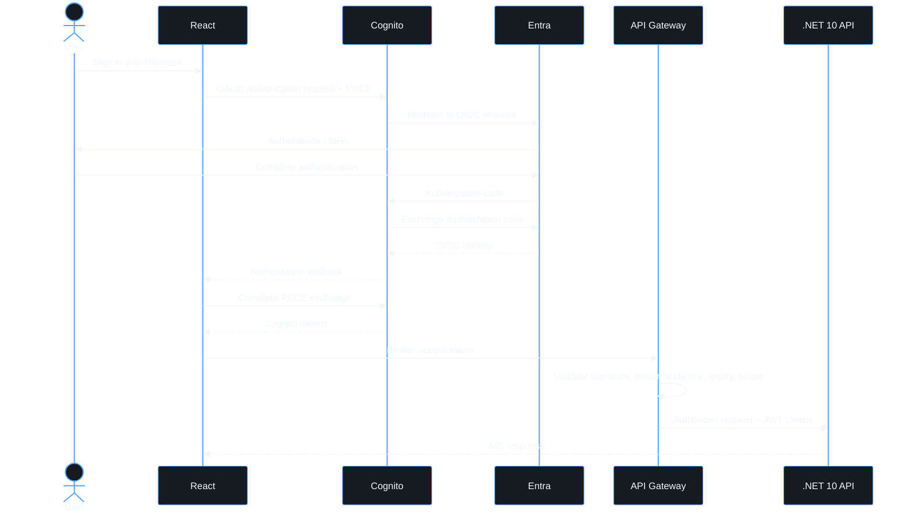

# Authentication

Two callbacks. Do not mix them.

1. Entra → Cognito: `https://<cognito-domain>/oauth2/idpresponse`
2. Cognito → React: `/auth/callback` (local `http://localhost:5173/auth/callback`)

OIDC provider name is `MicrosoftEntraID`. The SPA client has no secret; authorization code + PKCE only.

## Tokens

Send the Cognito **access token**, never the ID token, as `Authorization: Bearer`. Resource server `runbook-api` with scopes `read`, `write`, and `admin`.

Frontend contains no Entra secret. Amplify stores the Cognito session; do not persist tokens in `localStorage` yourself.

## Session lifecycle in the SPA

- **Initial load / existing session** — `AuthProvider` calls `getCurrentUser()` and then `fetchAuthSession()`. A cached user whose session can no longer mint an access token (refresh token expired or revoked) is signed out with "Your session has expired".
- **Expired session mid-use** — any API `401` (including a missing access token) flows through the shared React Query cache into `expireSession()`: local sign-out, then `/login` with the same message. `403` is a permission problem and is shown in place.
- **Unauthenticated navigation** — `ProtectedRoute` sends the visitor to `/login` remembering the path (`state.from`). `login()` stores it in `sessionStorage` for the OAuth round trip and `/auth/callback` returns there. Only same-origin absolute paths are honoured; `//host`, `/\host`, and external URLs fall back to `/`.
- **Failed redirect** — `signInWithRedirect_failure` or an exception from `signInWithRedirect` lands on `/login` with the error.
- **Logout** — `signOut()` clears the Amplify session and the provider state.
