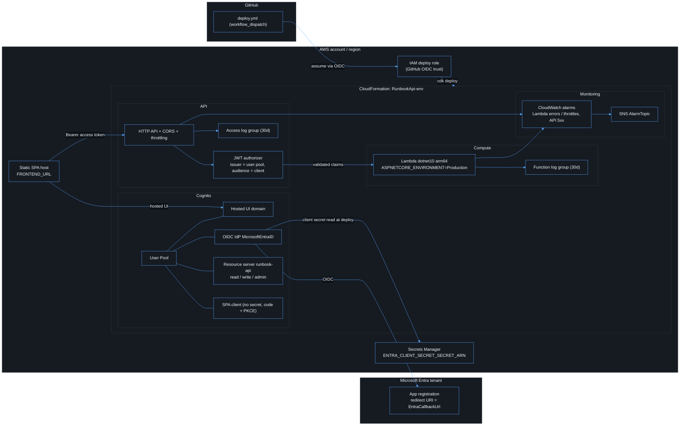
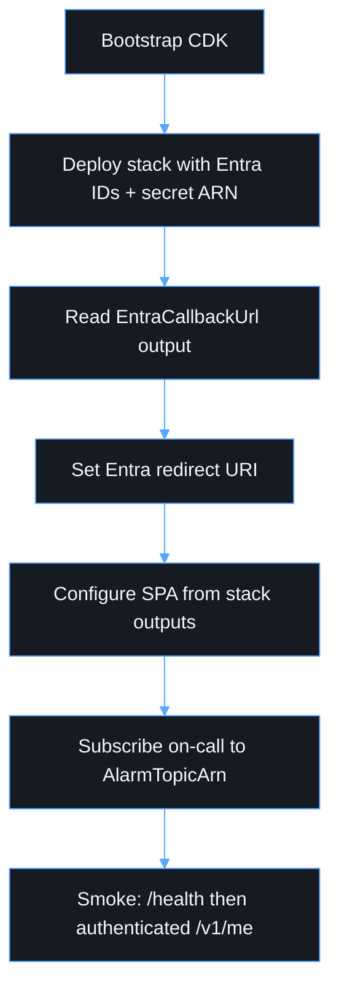

# Deployment

## Infrastructure

One CDK stack per environment, `RunbookApi-<ENVIRONMENT_NAME>`. Everything below is created by `infra/` except the Entra app registration and the Secrets Manager secret, which are referenced by ID/ARN.

Stack outputs: `ApiUrl`, `UserPoolId`, `UserPoolClientId`, `CognitoDomain`, `AwsRegion`, `EntraCallbackUrl`, `AlarmTopicArn`. No secret ever appears in outputs.

## Order

1. `cdk bootstrap` in the target account/region.
2. Create the Entra app registration and store the client secret in Secrets Manager.
3. Export `ENVIRONMENT_NAME` (`dev`, `test`, or `prod` — anything else fails synth), `AWS_ACCOUNT_ID`, `AWS_REGION`, `ENTRA_TENANT_ID`, `ENTRA_CLIENT_ID`, `ENTRA_CLIENT_SECRET_SECRET_ARN`, `COGNITO_DOMAIN_PREFIX`, and the frontend URLs. Outside localhost every frontend URL must be `https://`; in `prod` none may be localhost and the origin may not be `*`. Violations fail at synth, not after deploy.
4. Publish the API: `dotnet publish apps/api/src/Web/Web.csproj -c Release -r linux-arm64 --self-contained false -o apps/api/src/Web/bin/lambda`
5. `npm run cdk:synth` then `npm run cdk:diff` then `npm run cdk:deploy`.
6. Put `EntraCallbackUrl` on the Entra app.
7. Copy `ApiUrl`, `UserPoolId`, `UserPoolClientId`, `CognitoDomain` into the SPA `VITE_*` variables.
8. Build the SPA and host it at `FRONTEND_URL`. Set production callback/logout URLs on the Cognito client (redeploy if they changed).
9. Subscribe an on-call endpoint to `AlarmTopicArn`; nothing is subscribed by default.

GitHub Actions CI synthesizes; it does not deploy from pull requests. Deploy with GitHub OIDC into AWS, not long-lived access keys. `.github/workflows/deploy.yml` takes the environment as a fixed choice and passes the same configuration to `cdk diff` and `cdk deploy`.
