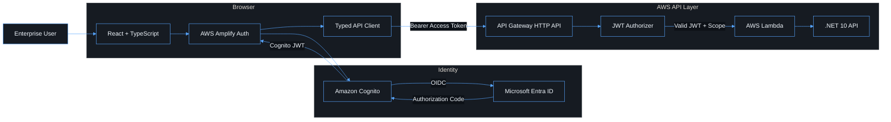
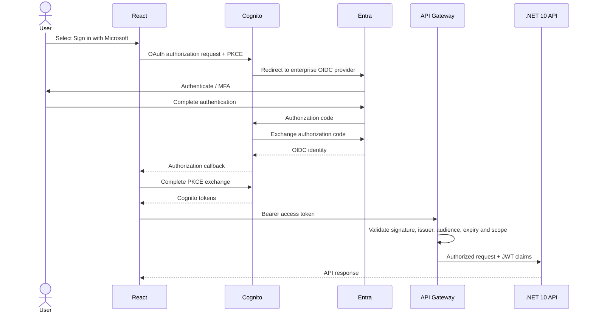

# Role

Act as a **Principal AWS Cloud Security Engineer, Senior .NET 10 Engineer, Senior React/TypeScript Engineer, and DevSecOps Engineer**.

Build a production-quality authentication and API foundation for a new web application.

The solution must be secure by default, fully wired end-to-end, testable locally where practical, deployable through infrastructure as code, and thoroughly documented.

Do not produce pseudocode where working code can reasonably be created.

Do not leave core authentication, authorization, configuration, testing, deployment, or wiring as TODO items.

---

## Primary Objective

Build the following architecture:

```text
React + TypeScript SPA
        |
        | Sign in with Microsoft
        v
AWS Amplify Auth
        |
        v
Amazon Cognito User Pool
        |
        | OIDC Federation
        v
Microsoft Entra ID
        |
        | Enterprise authentication
        v
Amazon Cognito
        |
        | Cognito Access Token
        v
React API Client
        |
        | Authorization: Bearer <access-token>
        v
Amazon API Gateway HTTP API
        |
        | JWT Authorizer + OAuth Scopes
        v
.NET 10 API on AWS Lambda
        |
        +---- Application services
        +---- AWS services
        +---- Future database/storage integrations
```

The browser must **never receive or store the Microsoft Entra client secret**.

Microsoft Entra authenticates the user.

Amazon Cognito acts as the federation broker and application identity provider.

API Gateway validates Cognito-issued access tokens.

The .NET API receives an already authenticated request and applies application-level authorization as defense in depth.

---

# Technology Stack

## Frontend

Use:

* React
* TypeScript
* Vite
* AWS Amplify v6
* `aws-amplify/auth`
* React Router
* TanStack Query
* native `fetch` or a clean typed API client
* Vitest
* React Testing Library
* `@testing-library/user-event`
* ESLint
* TypeScript ESLint
* Prettier
* Playwright for critical authentication/API E2E scenarios where practical

Use strict TypeScript.

Enable:

```json
{
  "strict": true,
  "noUncheckedIndexedAccess": true,
  "noImplicitOverride": true
}
```

Do not use `any` unless absolutely unavoidable and documented.

---

# Backend

Use:

* .NET 10
* C#
* ASP.NET Core Minimal APIs
* AWS Lambda managed runtime `dotnet10`
* Amazon.Lambda.AspNetCoreServer.Hosting
* API Gateway HTTP API payload v2
* dependency injection
* structured logging
* nullable reference types
* implicit usings where appropriate
* System.Text.Json
* OpenAPI generation
* health endpoints
* RFC 7807 Problem Details

Target:

```xml
<TargetFramework>net10.0</TargetFramework>
```

Use:

```csharp
builder.Services.AddAWSLambdaHosting(LambdaEventSource.HttpApi);
```

The architecture must work both:

```text
locally:
ASP.NET Core / Kestrel

AWS:
API Gateway HTTP API -> Lambda -> ASP.NET Core
```

---

# Infrastructure

Use:

* AWS CDK v2
* TypeScript
* API Gateway HTTP API
* Amazon Cognito User Pool
* Cognito User Pool Client
* Cognito OIDC Identity Provider
* Cognito domain
* OAuth 2.0 authorization code flow
* PKCE
* API Gateway JWT Authorizer
* Cognito Resource Server
* OAuth scopes
* AWS Lambda
* CloudWatch Logs
* Secrets Manager
* SSM Parameter Store where appropriate
* IAM least privilege

Do not configure production infrastructure manually if it can reasonably be represented in CDK.

---

# Microsoft Entra Configuration

The deployment must support a **new Microsoft Entra tenant**.

Do not hard-code the tenant ID.

Use configuration such as:

```text
ENTRA_TENANT_ID
ENTRA_CLIENT_ID
ENTRA_CLIENT_SECRET_SECRET_ARN
```

The OIDC issuer must be constructed from the tenant ID:

```text
https://login.microsoftonline.com/{ENTRA_TENANT_ID}/v2.0
```

The Cognito OIDC provider name should be:

```text
MicrosoftEntraID
```

Use the minimum required OIDC scopes:

```text
openid
profile
email
```

Do not request Microsoft Graph permissions unless the application actually requires them.

---

# Entra Application Registration

Document exactly how to create the Microsoft Entra application registration.

Include:

1. Create application registration.
2. Record:

```text
Tenant ID
Application / Client ID
```

1. Create an application client secret.
2. Store the secret securely in AWS Secrets Manager.
3. Never place the secret in:

```text
.env
React
VITE_*
Git
CDK source
CloudFormation outputs
README examples containing real credentials
```

1. Configure Cognito's OIDC callback URL in the Entra application.

The redirect URI used by Entra must be:

```text
https://<cognito-domain>/oauth2/idpresponse
```

Explicitly document the difference between:

```text
Entra -> Cognito callback
```

and:

```text
Cognito -> React callback
```

These are different URLs.

---

# Cognito Configuration

Create a Cognito User Pool.

Create an SPA app client.

The SPA app client must:

* not have a client secret
* use authorization code grant
* use PKCE
* allow the Microsoft Entra OIDC provider
* use appropriate token expiration values
* use explicit callback URLs
* use explicit logout URLs

Support environments such as:

```text
local
dev
test
prod
```

Example local callback:

```text
http://localhost:5173/auth/callback
```

Example local logout:

```text
http://localhost:5173/
```

Production URLs must be configurable.

---

# Cognito OIDC Provider

Configure Microsoft Entra as an OIDC provider for Cognito.

Issuer:

```text
https://login.microsoftonline.com/{ENTRA_TENANT_ID}/v2.0
```

Configure:

```text
client_id
client_secret
authorize_scopes
oidc_issuer
```

Use Secrets Manager or a CloudFormation/CDK secret reference for the client secret.

Never expose the resolved secret through stack outputs.

Map appropriate claims.

At minimum consider:

```text
sub
email
given_name
family_name
name
preferred_username
```

Map only attributes that are actually required.

---

# OAuth Resource Server

Create a Cognito Resource Server.

Use a stable identifier such as:

```text
runbook-api
```

Define scopes:

```text
runbook-api/read
runbook-api/write
runbook-api/admin
```

Use access tokens for API authorization.

Do not use the Cognito ID token as the normal API authorization credential.

---

# API Gateway

Create an **API Gateway HTTP API**.

Configure a JWT Authorizer using the Cognito User Pool.

Issuer:

```text
https://cognito-idp.<region>.amazonaws.com/<user-pool-id>
```

Audience:

```text
<cognito-app-client-id>
```

Identity source:

```text
$request.header.Authorization
```

Every sensitive route must require authorization.

Prefer OAuth scopes on routes.

Example:

```text
GET    /v1/me                 authenticated
GET    /v1/runbooks           runbook-api/read
GET    /v1/runbooks/{id}      runbook-api/read

POST   /v1/runbooks           runbook-api/write
PUT    /v1/runbooks/{id}      runbook-api/write
DELETE /v1/runbooks/{id}      runbook-api/write

GET    /v1/admin/*             runbook-api/admin
```

A health endpoint may intentionally remain unauthenticated:

```text
GET /health
```

It must disclose no sensitive environment or infrastructure information.

---

# API Gateway Security

Configure:

* restrictive CORS
* allowed production frontend origins only
* configurable localhost origin for development
* `Authorization` header
* appropriate HTTP methods
* TLS only
* access logging
* request correlation IDs
* throttling where supported/appropriate

Do not use:

```text
Access-Control-Allow-Origin: *
```

for the authenticated production API.

---

# React Login Experience

Create a polished professional login page.

It must have:

```text
Application logo / application name
"Sign in with Microsoft" button
short enterprise SSO explanation
loading state
authentication error state
redirect state
accessible keyboard navigation
responsive layout
dark theme
```

No username/password fields should be displayed if Microsoft Entra SSO is the only supported authentication mechanism.

The primary action should call:

```ts
signInWithRedirect({
  provider: {
    custom: "MicrosoftEntraID",
  },
});
```

Use AWS Amplify v6 APIs.

---

# Amplify Configuration

Configure Amplify centrally.

Do not scatter authentication configuration throughout the application.

Create something similar to:

```text
src/
  config/
    auth.ts
    env.ts
```

Frontend configuration may contain only non-secret values such as:

```text
VITE_AWS_REGION
VITE_COGNITO_USER_POOL_ID
VITE_COGNITO_CLIENT_ID
VITE_COGNITO_DOMAIN
VITE_API_URL
VITE_COGNITO_REDIRECT_SIGN_IN
VITE_COGNITO_REDIRECT_SIGN_OUT
```

Never include:

```text
ENTRA_CLIENT_SECRET
AWS_SECRET_ACCESS_KEY
database passwords
private API credentials
```

---

# React Authentication Layer

Create:

```text
AuthProvider
useAuth()
ProtectedRoute
LoginPage
AuthCallbackPage
Logout
```

Auth state should expose useful information similar to:

```ts
interface AuthState {
  isLoading: boolean;
  isAuthenticated: boolean;
  user: AuthUser | null;
  error: Error | null;
}
```

Handle:

```text
initial application load
existing Cognito session
successful redirect
expired session
failed redirect
logout
unauthenticated navigation
```

Avoid redirect loops.

---

# API Client

Create one central API client.

For each authenticated request:

```ts
const session = await fetchAuthSession();
const token = session.tokens?.accessToken?.toString();
```

Send:

```http
Authorization: Bearer <access_token>
```

Do not send the ID token by default.

The API client must handle:

```text
200
201
204
400
401
403
404
409
429
500
network failures
timeouts
invalid JSON
```

Create typed error handling.

Do not silently swallow authorization errors.

---

# TanStack Query

Create reusable query patterns for authenticated API access.

Examples:

```text
useCurrentUser()
useRunbooks()
useRunbook(id)
```

Do not duplicate authentication/token retrieval logic in every component.

---

# .NET Authentication Context

API Gateway is the primary JWT validation boundary.

Use the API Gateway HTTP API JWT authorizer.

The ASP.NET Core Lambda hosting integration should consume the authenticated principal made available from API Gateway authorizer claims.

Create a clean abstraction such as:

```csharp
ICurrentUser
CurrentUser
```

Expose:

```text
Subject
Email
DisplayName
Scopes
Groups when present
```

Never trust user identity supplied through arbitrary client request headers such as:

```text
X-User
X-Email
X-Roles
```

Identity must come from validated JWT claims.

---

# Defense in Depth

Although API Gateway validates the JWT, the .NET application must still validate required authorization context.

For sensitive operations:

```text
verify required scope
verify required application role if relevant
verify tenant/application constraints
reject missing subject
reject malformed claims
```

Use ASP.NET Core authorization policies where practical.

Examples:

```text
RequireAuthenticatedUser
RequireReadScope
RequireWriteScope
RequireAdminScope
```

Return:

```text
401
```

for unauthenticated requests.

Return:

```text
403
```

for authenticated but unauthorized requests.

---

# Current User Endpoint

Implement:

```http
GET /v1/me
```

Return a sanitized representation such as:

```json
{
  "subject": "...",
  "email": "...",
  "displayName": "...",
  "scopes": [
    "runbook-api/read"
  ]
}
```

Do not return:

```text
raw access token
refresh token
entire JWT
internal security claims
client secrets
```

---

# .NET Project Structure

Use a professional solution structure such as:

```text
src/
  Web/
    Program.cs
    Endpoints/
    Authentication/
    Authorization/
    Middleware/
    Contracts/
    Configuration/

  Application/
    Abstractions/
    Services/

  Domain/

  Infrastructure/
    Aws/
    Persistence/

tests/
  Web.UnitTests/
  Web.IntegrationTests/
  Application.UnitTests/
```

Avoid unnecessary Clean Architecture ceremony for trivial code.

Keep boundaries useful and practical.

---

# Backend HTTP Pipeline

Configure:

```text
Exception handling
Problem Details
Correlation IDs
Authentication context
Authorization
Request logging
Endpoints
```

Do not log:

```text
Authorization headers
JWTs
refresh tokens
client secrets
passwords
cookies containing authentication material
```

---

# Lambda

Package the .NET API for AWS Lambda.

Use:

```text
dotnet10
```

Configure:

```text
memory
timeout
architecture
environment variables
CloudWatch log retention
tracing if appropriate
reserved concurrency only if justified
```

Start with sensible values.

Do not give the Lambda broad IAM permissions.

Grant AWS permissions per service and action.

---

# Infrastructure Repository Structure

Use a layout similar to:

```text
/
├── apps/
│   ├── web/
│   │   ├── src/
│   │   ├── tests/
│   │   └── package.json
│   │
│   └── api/
│       ├── src/
│       ├── tests/
│       └── Api.sln
│
├── infra/
│   ├── bin/
│   │   └── app.ts
│   ├── lib/
│   │   ├── auth/
│   │   ├── api/
│   │   ├── security/
│   │   ├── monitoring/
│   │   └── config/
│   ├── test/
│   ├── cdk.json
│   └── package.json
│
├── docs/
│   ├── architecture.md
│   ├── authentication.md
│   ├── entra-setup.md
│   ├── deployment.md
│   ├── local-development.md
│   ├── security.md
│   └── troubleshooting.md
│
├── .editorconfig
├── .gitignore
├── README.md
└── AGENTS.md
```

Adjust only when there is a clear technical reason.

---

# Environment Configuration

Create typed environment configuration.

Support:

```text
local
dev
test
prod
```

Fail fast when required values are absent.

Infrastructure configuration should include:

```text
AWS_ACCOUNT_ID
AWS_REGION

ENTRA_TENANT_ID
ENTRA_CLIENT_ID
ENTRA_CLIENT_SECRET_SECRET_ARN

COGNITO_DOMAIN_PREFIX

FRONTEND_URL
FRONTEND_CALLBACK_URL
FRONTEND_LOGOUT_URL
```

No secrets in Git.

Provide:

```text
.env.example
```

containing placeholders only.

---

# CDK Outputs

Output only non-secret values required to configure the frontend.

Examples:

```text
ApiUrl
UserPoolId
UserPoolClientId
CognitoDomain
AwsRegion
```

Never output:

```text
Entra client secret
Secrets Manager resolved value
refresh tokens
private credentials
```

---

# Testing Requirements

Testing is mandatory.

## React unit tests

Test:

```text
login page rendering
login button
signInWithRedirect invocation
loading state
failed authentication
authenticated state
ProtectedRoute
logout
API bearer token injection
401 handling
403 handling
missing access token
```

Use:

```text
Vitest
React Testing Library
user-event
```

---

# Frontend Integration Tests

Test the API client independently from components.

Mock:

```text
fetchAuthSession
fetch
```

Verify that:

```text
access token is used
ID token is not accidentally used
Authorization header is correct
tokens are not logged
```

---

# .NET Unit Tests

Use xUnit.

Test:

```text
CurrentUser claim parsing
scope parsing
authorization policies
missing subject
missing email
missing required scope
admin authorization
Problem Details responses
```

---

# .NET Integration Tests

Use:

```text
WebApplicationFactory
```

where practical.

Test:

```text
GET /health
GET /v1/me
authenticated request
unauthenticated request
forbidden request
scope-based authorization
malformed identity context
```

---

# CDK Tests

Test synthesized infrastructure.

Verify:

```text
HTTP API exists
JWT authorizer exists
issuer is Cognito
audience is Cognito app client
Lambda uses dotnet10
protected routes have authorizers
required OAuth scopes are attached
CORS is not wildcard in production
log groups have retention
IAM policies are least privilege
Cognito app client has no SPA secret
OIDC provider exists
```

Use CDK assertions.

---

# End-to-End Tests

Where credentials/test tenants are available, create Playwright tests covering:

```text
unauthenticated user
login redirect
post-authentication return
protected page
API request
logout
```

Do not attempt to automate Microsoft MFA by weakening authentication controls.

Provide a documented strategy for mocked or dedicated test-tenant E2E authentication.

---

# Linting

## TypeScript

Configure:

```text
ESLint
typescript-eslint
React hooks linting
import hygiene
unused import detection
```

Lint must fail CI on errors.

---

# Formatting

Use:

```text
Prettier
dotnet format
.editorconfig
```

Provide commands:

```bash
npm run format
npm run format:check
dotnet format
dotnet format --verify-no-changes
```

Formatting must be deterministic.

---

# .NET Static Analysis

Enable:

```text
nullable
recommended .NET analyzers
warnings for insecure or suspicious patterns
```

Treat important warnings as errors.

Do not blindly enable warnings-as-errors for generated Lambda/CDK artifacts if this makes the build brittle.

---

# Standard Commands

Provide root-level commands or documented equivalents for:

```text
install
build
dev
test
test:unit
test:integration
test:e2e
lint
format
format:check
typecheck
cdk:synth
cdk:diff
cdk:deploy
clean
```

A clean checkout should have a predictable workflow.

---

# CI Pipeline

Create a GitHub Actions workflow.

Pipeline should run:

```text
install dependencies
restore .NET packages
frontend typecheck
frontend lint
frontend tests
frontend build
.NET restore
.NET build
.NET tests
dotnet format --verify-no-changes
CDK tests
CDK synth
security checks
```

Deployment must not occur from an untrusted pull request.

Prefer GitHub OIDC federation into AWS rather than long-lived AWS access keys.

---

# Security Requirements

Follow:

```text
AWS Well-Architected Framework
AWS Security Pillar
OWASP ASVS principles
OAuth 2.0 / OIDC best practices
least privilege
secure by default
defense in depth
```

Specifically:

* authorization code + PKCE
* no implicit OAuth flow
* no browser client secret
* no localStorage token persistence implemented manually
* no secrets committed to Git
* no wildcard production CORS
* no raw JWT logging
* no broad IAM `*` permissions without documented justification
* access tokens for API authorization
* authorization scopes on protected routes
* HTTPS only outside localhost
* secure logout behavior
* secure redirect URI allowlists

---

# Logging

Use structured logging.

Every API request should support a correlation/request ID.

Include useful values such as:

```text
request ID
route
HTTP method
response status
duration
authenticated subject when appropriate
```

Never log authentication credentials.

---

# Error Handling

Return RFC 7807 Problem Details from the API.

Example shape:

```json
{
  "type": "https://example.com/problems/forbidden",
  "title": "Forbidden",
  "status": 403,
  "detail": "The authenticated user does not have the required permission.",
  "traceId": "..."
}
```

Do not expose stack traces to clients in production.

---

# Documentation

All documentation must live under:

```text
docs/
```

except:

```text
README.md
AGENTS.md
```

Use lowercase kebab-case filenames.

Every major architecture or workflow document must contain a professional Mermaid diagram where a diagram materially improves understanding.

Examples:

```text
architecture.md
authentication.md
entra-setup.md
deployment.md
security.md
```

---

# Mermaid Standard

Use dark, high-contrast Mermaid diagrams.

Use this theme consistently:

```mermaid
%%{init: {
  "theme": "base",
  "securityLevel": "strict",
  "themeVariables": {
    "background": "#0d1117",
    "mainBkg": "#161b22",
    "secondBkg": "#1c2128",
    "primaryColor": "#161b22",
    "primaryTextColor": "#f0f6fc",
    "primaryBorderColor": "#58a6ff",
    "secondaryColor": "#21262d",
    "secondaryTextColor": "#f0f6fc",
    "secondaryBorderColor": "#3fb950",
    "tertiaryColor": "#21262d",
    "tertiaryTextColor": "#f0f6fc",
    "tertiaryBorderColor": "#d29922",
    "lineColor": "#58a6ff",
    "textColor": "#f0f6fc",
    "clusterBkg": "#161b22",
    "clusterBorder": "#30363d",
    "edgeLabelBackground": "#0d1117",
    "fontFamily": "Inter, Arial, Helvetica, sans-serif"
  }
}}%%
```

Do not use Mermaid's default light styling.

Keep diagrams readable in GitHub dark mode.

---

# Required Architecture Diagram

Create at minimum this architecture diagram and improve it where necessary:



---

# Required Authentication Sequence Diagram

Create:



Apply the full shared dark Mermaid theme to the actual documentation version.

---

# Additional Required Diagrams

Create professional dark Mermaid diagrams for:

1. System architecture
2. Authentication sequence
3. API authorization flow
4. Infrastructure/deployment architecture
5. Repository/component structure
6. Request lifecycle
7. CI/CD pipeline

Do not add diagrams merely as decoration.

Each diagram should explain a real technical relationship.

---

# README

The root README must explain:

```text
architecture
prerequisites
repository structure
local development
environment variables
Microsoft Entra setup
AWS setup
authentication flow
running tests
linting
formatting
CDK synth
CDK diff
deployment
troubleshooting
security notes
```

Include links to the detailed documents under `/docs`.

---

# Deployment Order

Document and automate as much of this as practical:

```text
1. Bootstrap AWS CDK.
2. Create Cognito User Pool and domain.
3. Determine Cognito /oauth2/idpresponse callback URL.
4. Create/configure Microsoft Entra application registration.
5. Store Entra client secret in AWS Secrets Manager.
6. Supply ENTRA_TENANT_ID and ENTRA_CLIENT_ID.
7. Configure Cognito OIDC provider.
8. Create Cognito app client/resource server/scopes.
9. Deploy .NET Lambda API.
10. Deploy API Gateway JWT authorizer/routes.
11. Obtain frontend configuration outputs.
12. Configure/build React SPA.
13. Configure final production callback/logout URLs.
14. Run smoke tests.
15. Run authenticated API test.
```

Handle any necessary two-phase deployment cleanly.

---

# Acceptance Criteria

The implementation is complete only when all of the following work:

### Authentication

```text
React login page opens
Sign in with Microsoft works
Entra authenticates the user
Cognito receives the federated identity
React receives a Cognito session
refresh/session restoration works
logout works
```

### Authorization

```text
Cognito access token reaches API Gateway
JWT authorizer validates token
invalid token returns 401
expired token returns 401
missing scope returns 403
valid scope invokes Lambda
.NET receives authenticated claims
```

### Application

```text
GET /health works
GET /v1/me works for authenticated users
protected React route works
API client automatically attaches access token
```

### Engineering Quality

```text
frontend builds
backend builds
CDK synthesizes
all unit tests pass
all integration tests pass
lint passes
typecheck passes
format check passes
documentation exists
Mermaid diagrams render
no credentials are committed
```

---

# Required Final Output

After implementation, provide:

```text
1. Architecture summary
2. Repository tree
3. Files created
4. Authentication flow
5. Authorization model
6. Microsoft Entra configuration instructions
7. Required environment variables
8. Secrets Manager setup
9. AWS deployment commands
10. Frontend development commands
11. Backend development commands
12. Test commands
13. Lint commands
14. Formatting commands
15. CDK synth/diff/deploy commands
16. Known assumptions
17. Security decisions
18. Verification checklist
```

Also state explicitly:

```text
Frontend contains no Entra secret.
API authorization uses Cognito access tokens.
API Gateway performs JWT validation.
.NET 10 performs application-level authorization.
Microsoft Entra tenant ID is configurable and not hard-coded.
```

---

# Implementation Behaviour

Before writing code:

1. Inspect the existing repository if one exists.
2. Reuse established conventions when they are secure and sensible.
3. Do not replace working architecture unnecessarily.
4. Identify existing package manager and tooling.
5. Check current dependency compatibility.
6. Pin stable compatible dependency versions.
7. Build incrementally.
8. Run tests after implementation.
9. Run lint.
10. Run formatting checks.
11. Run TypeScript type checking.
12. Run `dotnet build`.
13. Run `dotnet test`.
14. Run CDK tests.
15. Run `cdk synth`.
16. Fix failures before declaring completion.

Do not claim that something works unless it has either been executed successfully or is clearly identified as requiring external credentials/infrastructure to verify.

When an external value is unknown, use an obvious placeholder such as:

```text
<ENTRA_TENANT_ID>
<ENTRA_CLIENT_ID>
<ENTRA_CLIENT_SECRET_SECRET_ARN>
<AWS_ACCOUNT_ID>
<AWS_REGION>
<FRONTEND_PRODUCTION_URL>
```

Never invent tenant IDs, secrets, AWS account IDs, domains, ARNs, or credentials.

One particularly useful detail for the .NET implementation: AWS's ASP.NET Core Lambda adapter maps HTTP API JWT-authorizer claims into `HttpContext.User`, so the API can build `ICurrentUser` and authorization policies from the API Gateway-authenticated principal rather than re-parsing arbitrary headers. ([GitHub][2])

Also, requiring scopes on API Gateway routes is worth keeping in the prompt. AWS specifically recommends scopes when you want API authorization to distinguish access-token usage from other JWTs. ([AWS Documentation][3])

[2]: https://github.com/aws/aws-lambda-dotnet/blob/master/Libraries/src/Amazon.Lambda.AspNetCoreServer/APIGatewayHttpApiV2ProxyFunction.cs?utm_source=chatgpt.com "aws-lambda-dotnet/Libraries/src/Amazon.Lambda.AspNetCoreServer/APIGatewayHttpApiV2ProxyFunction.cs at master · aws/aws-lambda-dotnet · GitHub"
[3]: https://docs.aws.amazon.com/apigateway/latest/developerguide/http-api-jwt-authorizer.html?utm_source=chatgpt.com "Control access to HTTP APIs with JWT authorizers in API Gateway - Amazon API Gateway"
