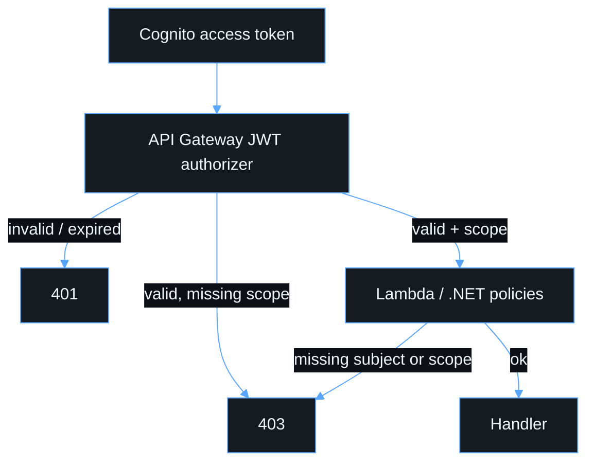

# Security

- Authorization code + PKCE. No implicit flow. No SPA client secret.
- Cognito access tokens authorize the API. API Gateway JWT authorizer is the validation boundary.
- .NET still applies scope policies (`RequireReadScope`, `RequireWriteScope`, `RequireAdminScope`).
- Identity comes from validated claims (`HttpContext.User`), never `X-User` / `X-Email` headers.
- No production CORS `*`.
- No secrets in Git, `VITE_*`, CDK source, or stack outputs.
- Do not log `Authorization` headers, JWTs, refresh tokens, or secrets.
- HTTPS only outside localhost. `infra/lib/security/guardrails.ts` fails synth on `http://` frontend URLs outside localhost, on any localhost or `*` origin in `prod`, and the API refuses to start with a `*` CORS origin.
- Lambda IAM starts with no data-plane `*` permissions.
- Every deployed Lambda runs `ASPNETCORE_ENVIRONMENT=Production`; the OpenAPI document is mapped only under local `Development` and still requires a bearer token.
- Dependencies are audited in CI (`npm audit --audit-level=high`, `dotnet package list --vulnerable`) and committed secrets are rejected by a scan.
- Request logs carry method, path, route, status, duration, subject and correlation ID — never headers, tokens or bodies.

